## 개요

- 진행기간 : 2025.05.22(목) ~ 2025.05.28(수)
- 주제 : 금융 추천 시스템
- 서비스명 : FinFinder

## 서비스 소개

하나의 사이트에서 종합적으로 금융상품을 찾을수 있고
나에게 맞는 금융상품까지 추천해주는 FinFinder 입니다.

## 메인 화면

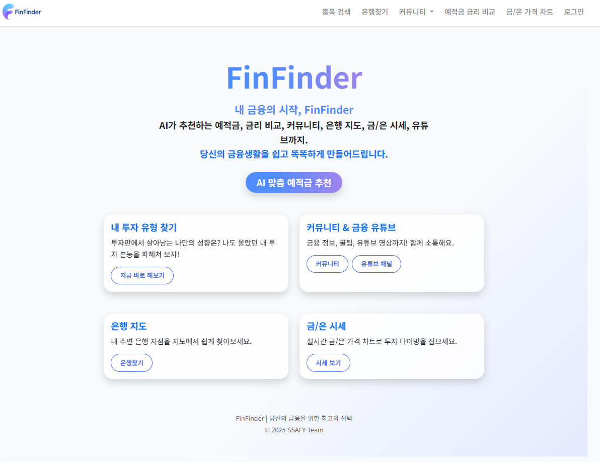

## 주요기능

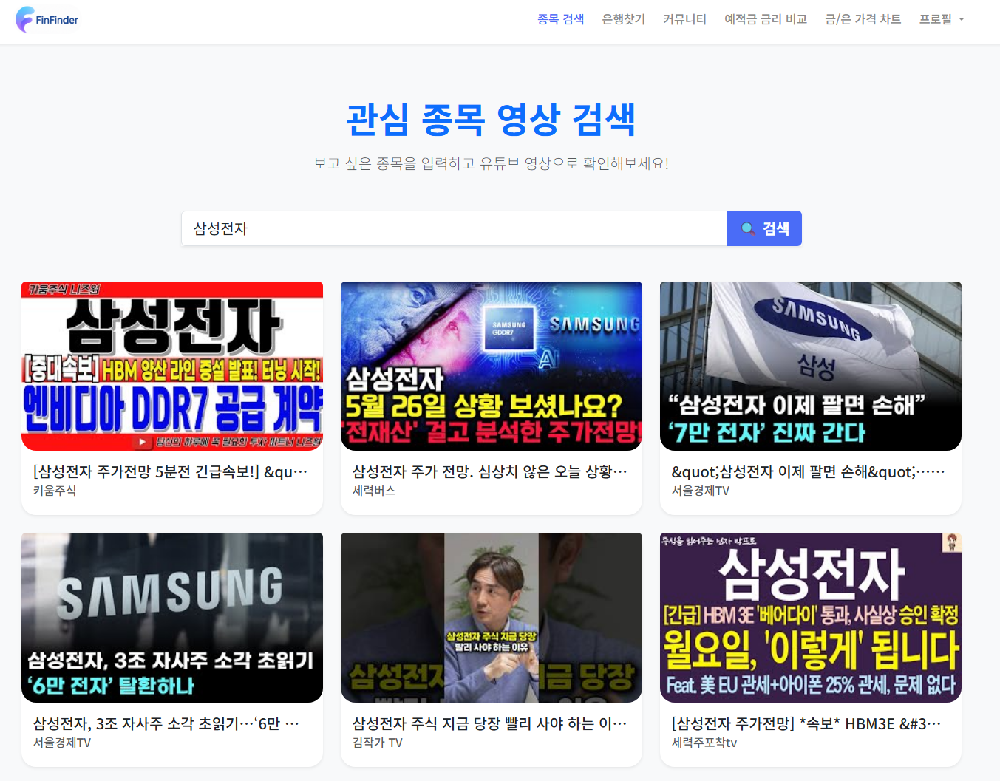
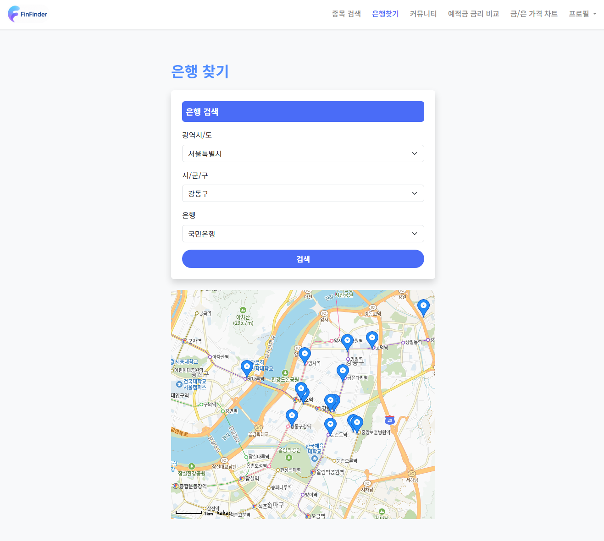
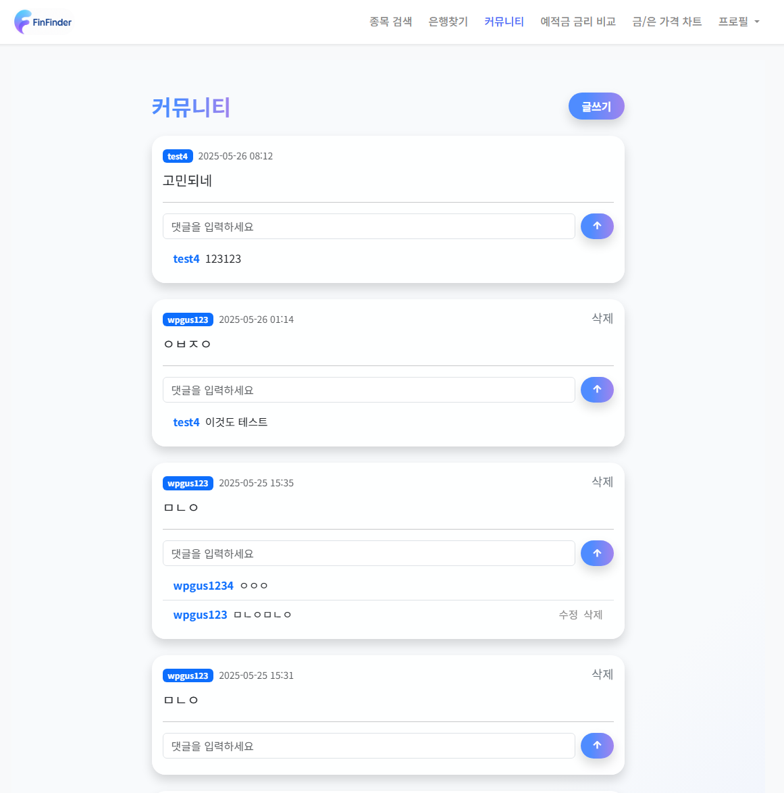
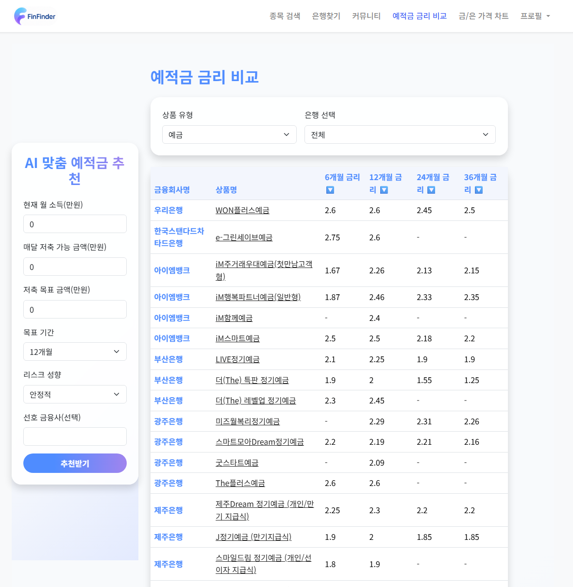
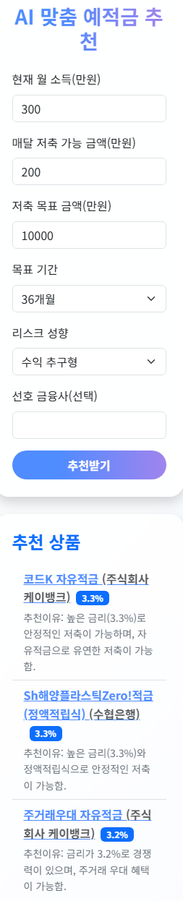
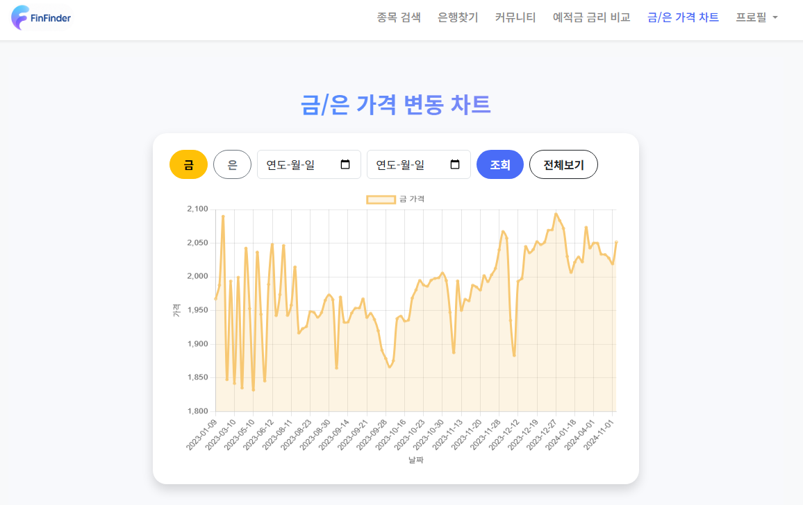
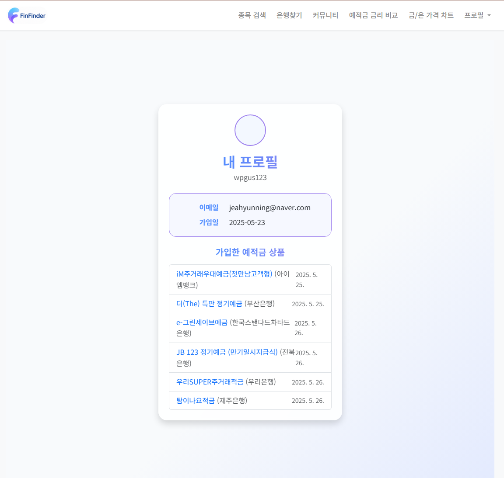
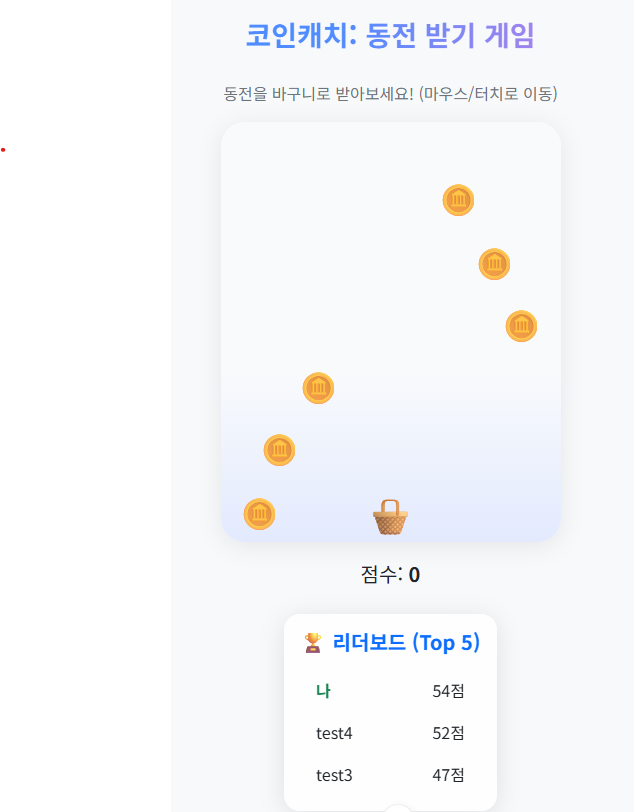
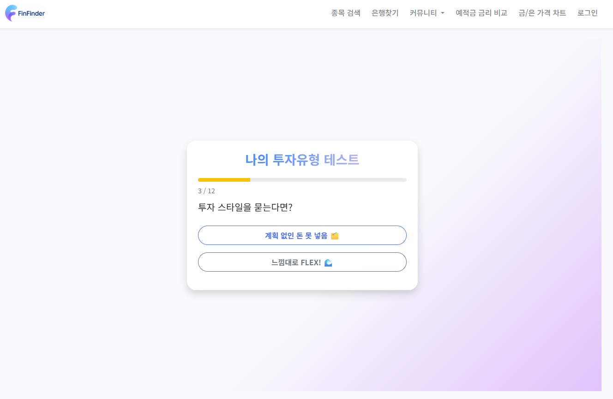

## 생성형 AI 활용

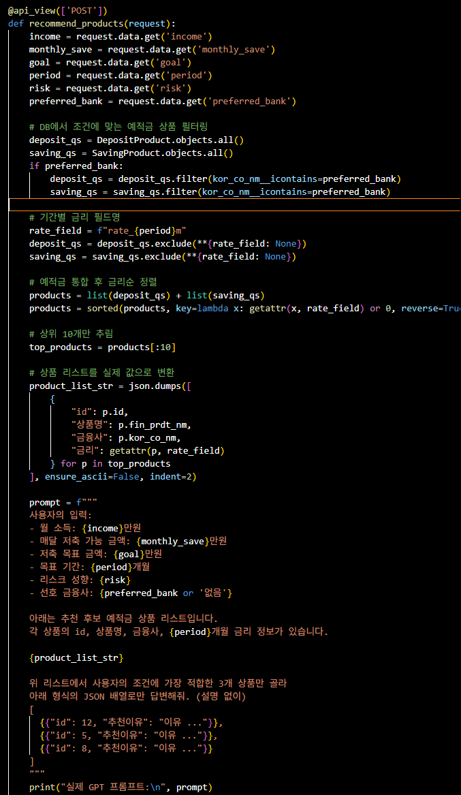

## 데이터베이스 모델링(ERD)

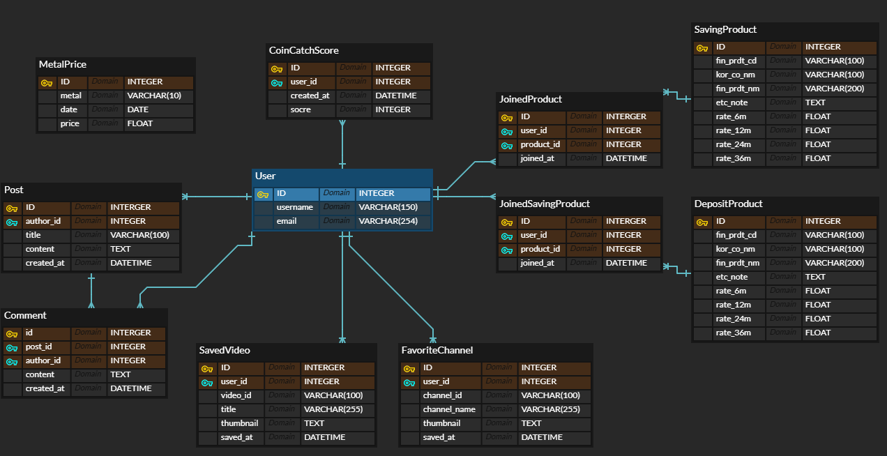

## 날짜별 작업

# 5-22(목)

1. 메인페이지 및 네비바 생성을 통한 큰 틀 작성
2. 어떤 기능을 넣을지 회의 및 작업공간 마련
3. 회원가입 / 로그인 기능 구현
4. 종목검색 기능 , 은행찾기 기능 구현

# 5-23(금)

1. 금/은 가격 차트 가격 비교 기능 구현
2. 커뮤니티 기능 구현
3. 외부API를 통한 예적금 금리비교 기능 구현
4. 금융상품 예상 금액 계산기 추가
5. 프로필 구현

# 5-26(월)

1. 각 기능들의 관심목록들을 프로필페이지와 연동
2. 커뮤니티 기능의 CRUD 손질
3. UI / UX 개선
4. ERD 작성

# 5-27(화)

1. UI / UX 개선
2. 발표자료 작성
3. 코인캐치 추가
4. 투자 유형 찾기

## 팀원 소개 및 소감
- 김효준(팀장) : 수업 때 배운 여러 기능들을 백지부터 적용해보려니 생각보다 많이 어려웠습니다. 다양한 기능들을 구현해볼 수 있는 좋은 기회였던 것 같습니다.
- 
- 연제현 : 처음엔 어떻게 할까 막막하였지만 배운걸 천천히 활용한다면
그닥 어렵지 않다는걸 느꼈습니다. 그동안 배웠던걸 종합하여 나만의 웹사이트를 만든다는것이 값진 경험인거같습니다.

